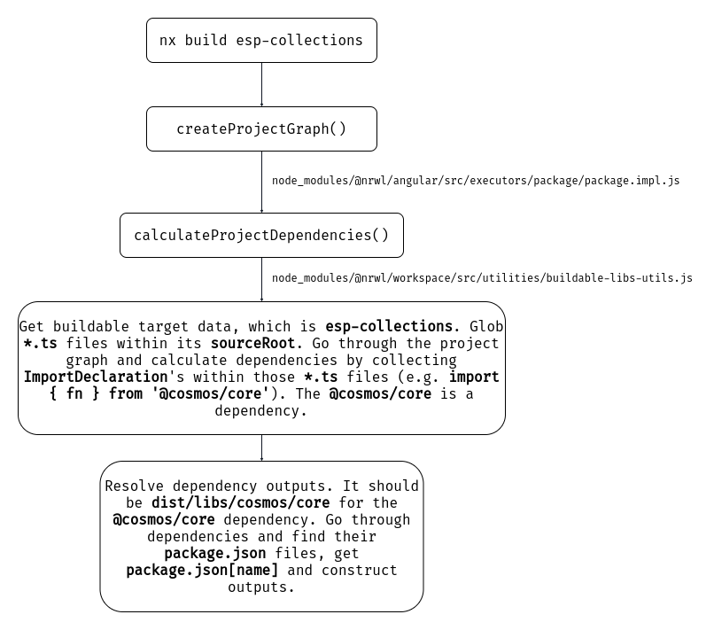

# NGX ESP

## Running Encore App:

```
requirements: node.js and npm package manager

clone repo: git clone git@github.com:asi/ngx-esp.git

cd ngx-esp

npm ci

npm start
```

## Generating a library

For instance, we'd want to generate a new library inside the `esp` folder. Let's call it `example`:

```sh
ng g @nrwl/angular:lib esp/example
```

This will generate a **buildable** library. Buildable libraries are used for incremental builds. You can then build the `esp-example` library by running the following command:

```sh
nx build esp-example
```

### Secondary Entry Points

We follow the official guide for secondary entry points (https://github.com/ng-packagr/ng-packagr/blob/master/docs/secondary-entrypoints.md). Secondary entry points should not be generated through schematics since it'll update workspace files (`nx.json` and `angular.json`) and generate many config files (e.g. `tsconfig.lib.json`, `jest.config.js`, etc.) for that secondary entry point. Have a look at the `libs/cosmos/common/http`.

You have to create a folder for any secondary entry point, create an empty `ng-package.json` there with an empty object:

```json
// libs/cosmos/common/http/ng-package.json
{}
```

Then create the `public_api.ts` (not `index.ts`) file within the `src` folder.

### Naming Libraries

We may have names with multiple slashes since we don't **publish** these packages. This will allow `ng-packagr` to resolve output paths correctly. Let's look at the following example:

```json
// package.json
{
  "name": "@cosmos/components/button"
}
```

### Resolving Outputs Mechanism



### Handling Errors

If you see some non-obvious errors, then try to log additional info to the console through the environment variable and `--verbose` flag:

```sh
DEBUG=true nx build esp-example --verbose
```

#### ❌ `rootDir` Error

Libraries can be _independent_ or should depend only on _buildable_ libraries. There're some common errors that you might meet when trying to make the library buildable. For instance, if you try to import `@cosmos/testing` library within the `esp-auth` library, then it'll throw such errors:

```
ERROR: libs/cosmos/testing/src/lib/cosmos-testing.module.ts:1:1 - error TS6059: File 'libs/cosmos/testing/src/lib/cosmos-testing.module.ngtypecheck.ts' is not under 'rootDir' 'libs/esp/auth/src'. 'rootDir' is expected to contain all source files.

1 import { NgModule } from '@angular/core';

libs/cosmos/testing/src/lib/general-helpers/promise-test-helper.ts:1:1 - error TS6059: File 'libs/cosmos/testing/src/lib/general-helpers/promise-test-helper.ngtypecheck.ts' is not under 'rootDir' 'libs/esp/auth/src'. 'rootDir' is expected to contain all source files.

1 export function createPromiseTestHelper<T = void>() {

libs/cosmos/testing/src/lib/general-helpers/skip-console-logging.ts:1:1 - error TS6059: File 'libs/cosmos/testing/src/lib/general-helpers/skip-console-logging.ngtypecheck.ts' is not under 'rootDir' 'libs/esp/auth/src'. 'rootDir' is expected to contain all source files.
```

The `'rootDir' is expected to contain all source files.` error is thrown when you build a library that depends on some other non-buildable library.

First of all, when starting making any library buildable, check if it depends on any other library and if it's buildable or not.

#### ❌ Output Path Resolution Errors

There're some similar errors that have the same root cause. These are:

> Some of the project dependencies have not been built yet

And:

> ERROR: Unable to write a reference to SomeComponent in some.component.ts from some.module.ts

The first error can be seen if all dependencies have _actually_ been built.

`ng-packagr` throws those errors when it cannot resolve the library output path, which might be `dist/libs/cosmos/components/button`.

There's an image above about the resolution mechanism.

> ⚠️ The `outputs` property inside the `build` target configuration is useless, `ng-packagr` doesn't respect it.

This usually happens with secondary entry points. `ng-packagr` takes the library name within its `package.json[name]`, removes the `@` symbol and constructs the output path. For instance, the `@cosmos/common/http` is resolved to `dist/libs/cosmos/common/http`, even if the `dest` property is different within the `ng-package.json`.

If we name the `@cosmos/common/http` as `@cosmos/common-http` then it will resolve the wrong output path - `dist/libs/cosmos/common-http`.

The `package.json[name]` can contain only one slash, e.g. `@cosmos/components-button`, but we should still name libraries with multiple slashes, since we don't publish them. It should be `@cosmos/components/button`.

`ng-packagr` updates TS config paths before building libraries. It takes the `tsconfig.lib.json` as the base config and then goes through dependencies and updates the `paths` property. Since libraries can depend only on buildable libraries, `ng-packagr` has to replace this:

```json
"@cosmos/components/button": ["libs/cosmos/components/button/src/index.ts"]
```

With this:

```json
"@cosmos/components/button": ["dist/libs/cosmos/components/button"]
```

If `ng-packagr` reads the `libs/cosmos/components/button/package.json` and meets the `@cosmos/components-button` then it won't replace the `@cosmos/components/button` with `dist/libs/cosmos/components/button`, since `options.path` doesn't contain `@cosmos/components-button`. The output will look as follows:

```json
"@cosmos/components/button": ["libs/cosmos/components/button/src/index.ts"],
"@cosmos/components-button": [
  "dist/libs/cosmos/components/button",
  "libs/cosmos/components/button/dist",
  "libs/cosmos/components/button/build",
  "libs/cosmos/components/button/public"
]
```

You should always check `paths` when you meet such errors when building some library. Go to `node_modules/@nrwl/angular/src/executors/ng-packagr-lite/ng-packagr-lite.impl.js` and find the `initializeNgPackgrLite` function:

```js
if (options.tsConfig) {
  const parsedTSConfig = ng.readConfiguration(options.tsConfig);
  buildable_libs_utils_1.updatePaths(
    projectDependencies,
    parsedTSConfig.options.paths
  );
  console.log(parsedTSConfig.options.paths);
  packager.withTsConfig(parsedTSConfig);
}
```

This will log `options.paths` to the console, and you may notice that some path is not updated to contain `dist/libs/...`. Then check `package.json[name]` and re-build the library.

### Mocks

Do not keep mocks inside the `lib` folder. Instead, keep them outside on the same level with an `src` folder.

Having mocks inside the `lib` folder breaks the dependency collection mechanism. For instance, the `@esp/auth` library doesn't and shouldn't depend on the `@esp/router` library. If you create the `mocks` folder and place some `.ts` files there, e.g.:

```
- libs/esp
  - auth
    - src
      - lib
        - mocks
          - some-file-with-mocks.ts
    - index.ts
  - router
```

And if you reference the `@esp/router` library within the `some-file-with-mocks.ts` file, then `ng-packagr` will think that `@esp/auth` depends on the `@esp/router`. It globs all `.ts` files inside the `lib` folder and collects `ImportDeclaration`s by parsing `.ts` files into TS source files. Then it goes through all source files and their import declarations and collects dependencies. Even if the `some-file-with-mocks.ts` is not referenced by any file inside the `@esp/auth`, the dependency collection mechanism will still be broken.

Consider putting mocks inside the `__mocks__` folder on the same level with `src`:

```
- libs/esp
  - auth
    - src
    - __mocks__
```

## Generate an ESP rest client

Run `npm run workspace-schematic -- esp-rest-client-module MyClient`

## Generate a Storybook

Run `nx g @nrwl/angular:storybook-configuration project-name`

## Development server

Run `ng serve my-app` for a dev server. Navigate to http://localhost:4200/. The app will automatically reload if you change any of the source files.

## Code scaffolding

Run `ng g component my-component --project=my-app` to generate a new component.

## Build

Run `ng build my-app` to build the project. The build artifacts will be stored in the `dist/` directory. Use the `--prod` flag for a production build.

## Building a storybook

Run `npx nx run my-lib:build-storybook`

## Running unit tests

Run `ng test my-app` to execute the unit tests via [Jest](https://jestjs.io).

Run `nx affected:test` to execute the unit tests affected by a change.

## Running vis tests

[Docker](https://docs.docker.com/get-docker/) is required for running vis tests

After installing docker:

1. Run `npx nx run cosmos-components:storybook`
2. Run `npm run vistest`

### Without running Storybook

**(will be slower)**

Run `npm run vistest:ci`

## Running end-to-end tests

Run `ng e2e my-app` to execute the end-to-end tests via [Cypress](https://www.cypress.io).

Run `nx affected:e2e` to execute the end-to-end tests affected by a change.

## Running storybook

Run `nx run project-name:storybook`

## Understand your workspace

Run `nx dep-graph` to see a diagram of the dependencies of your projects.

## Further help

Visit the [Nx Documentation](https://nx.dev/angular) to learn more.

[10-minute video showing all Nx features](https://nx.dev/angular/getting-started/what-is-nx)

[Interactive Tutorial](https://nx.dev/angular/tutorial/01-create-application)
